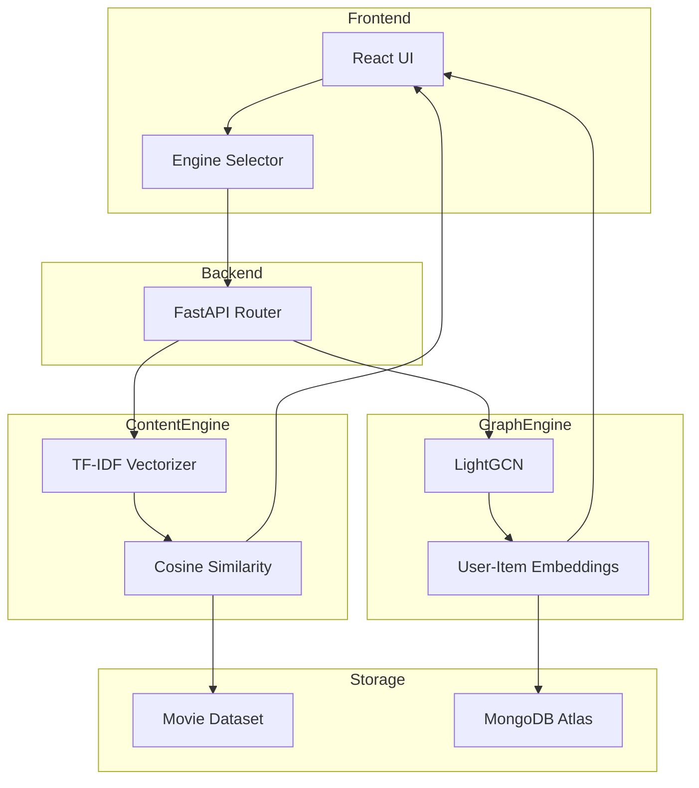

# 🎬 CineIQ: Dual-Engine Movie Recommendation System

CineIQ is a full-stack movie recommendation platform that combines **Content-Based Filtering** and **Graph-Based Collaborative Filtering** within a unified web application.

Users can seamlessly switch between two independent recommendation engines:

- **Content Engine** → Semantic similarity using TF-IDF and Cosine Similarity
- **Graph Engine** → Behavioral recommendations using LightGCN

The project demonstrates the integration of Machine Learning, Graph Neural Networks, FastAPI, React, and MongoDB into a production-style recommendation system.

---

## 🚀 Features

- Dual recommendation engines
- Interactive React dashboard
- FastAPI backend
- TF-IDF based semantic recommendations
- LightGCN collaborative filtering
- MongoDB Atlas integration
- REST API architecture
- Modular and scalable design

---

## 🏗️ System Architecture



---

## 🧠 Recommendation Engines

### 1. Content-Based Recommendation Engine

The content engine analyzes movie metadata such as:

- Plot overview
- Genres
- Keywords
- Cast information

These features are transformed into numerical vectors using **TF-IDF Vectorization**.

#### TF-IDF

[
TF(t,d)=\frac{f_{t,d}}{\sum_{t' \in d}f_{t',d}}
]

[
IDF(t,D)=\log\left(\frac{|D|}{1+|{d\in D:t\in d}|}\right)
]

#### Movie Representation

[
V_d=[TF(t_1,d)\cdot IDF(t_1,D),...,TF(t_n,d)\cdot IDF(t_n,D)]
]

#### Similarity Metric

Recommendations are generated using Cosine Similarity:

[
Similarity(A,B)=\frac{A\cdot B}{||A||,||B||}
]

---

### 2. Graph-Based Recommendation Engine

The collaborative filtering engine is built using **LightGCN (Light Graph Convolution Network)**.

Instead of analyzing movie content, LightGCN learns patterns from user-item interactions represented as a bipartite graph.

#### Graph Propagation

[
e_u^{(k+1)}
===========

\sum\_{i\in N_u}
\frac{1}
{\sqrt{|N_u||N_i|}}
e_i^{(k)}
]

[
e_i^{(k+1)}
===========

\sum\_{u\in N_i}
\frac{1}
{\sqrt{|N_i||N_u|}}
e_u^{(k)}
]

#### Layer Aggregation

[
e_u=\sum_{k=0}^{K}\alpha_k e_u^{(k)}
]

[
e_i=\sum_{k=0}^{K}\alpha_k e_i^{(k)}
]

#### Prediction

[
\hat y_{ui}=e_u^Te_i
]

Movies with higher affinity scores are ranked higher in recommendations.

---

## 🛠️ Tech Stack

### Frontend

- React
- Vite
- Tailwind CSS

### Backend

- FastAPI
- Uvicorn

### Machine Learning

- Scikit-Learn
- PyTorch
- LightGCN

### Database

- MongoDB Atlas

### Deployment & Development

- GitHub Codespaces
- GitHub
- Virtual Environments

---

## 📂 Project Structure

```text
CineIQ/
│
├── backend/
│   ├── main.py
│   ├── models/
│   ├── datasets/
│   └── recommender/
│
├── frontend/
│   ├── src/
│   ├── components/
│   └── pages/
│
├── README.md
└── requirements.txt
```

---

## ⚙️ Installation

### Clone Repository

```bash
git clone https://github.com/yourusername/CineIQ.git
cd CineIQ
```

---

### Backend Setup

```bash
cd backend

python3 -m venv venv

source venv/bin/activate
```

Install dependencies:

```bash
pip install fastapi uvicorn torch pandas scikit-learn pymongo
```

Run server:

```bash
python -m uvicorn main:app --reload
```

Backend will be available at:

```text
http://localhost:8000
```

---

### Frontend Setup

Open a second terminal:

```bash
cd frontend

npm install
npm run dev
```

Frontend will be available at:

```text
http://localhost:5173
```

---

## 🔍 API Endpoints

### Content-Based Recommendations

```http
GET /api/recommend/content/{movie_name}
```

Example:

```http
GET /api/recommend/content/Inception
```

---

### Graph-Based Recommendations

```http
GET /api/recommend/graph/{movie_name}
```

Example:

```http
GET /api/recommend/graph/Inception
```

---

## 📈 Future Improvements

- Hybrid recommendation engine
- User authentication
- Real-time recommendation updates
- Transformer-based movie embeddings
- Explainable AI recommendations
- Docker containerization
- Cloud deployment

---

## 👨‍💻 Author

**Kartik Khare**
Engineering Physics, IIT Guwahati

Interests:

- Machine Learning
- Graph Neural Networks
- Computational Physics
- Full Stack Development

---

## 📜 License

This project is released under the MIT License.
